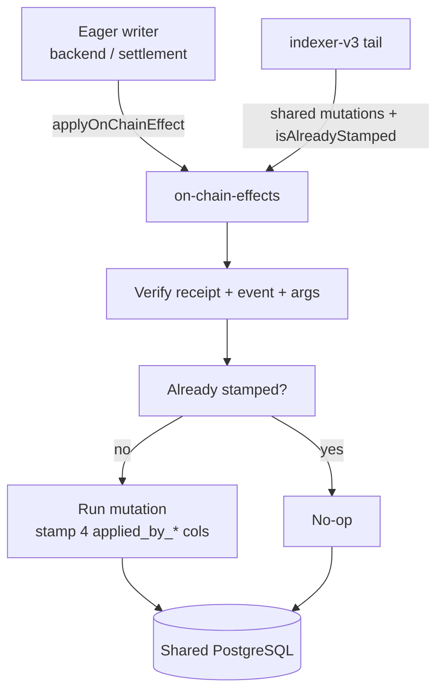

# @centuari-labs/on-chain-effects

The **C10 verify-then-apply** idempotency primitive shared between eager-path
writers (`backend-v2` and `settlement-engine`) and the `indexer-v3` tail. Both
paths apply the same mutation keyed by `(tx_hash, log_index)`; whichever commits
second no-ops.

This is the shared library at the heart of the [Centuari](https://github.com/centuari-labs/centuari) system's two-writer consistency model.

The settlement engine also has a separate stuck-`PENDING` recovery worker that
checks whether a match landed on-chain before releasing locks or quarantining a
ghost-settled record. That recovery worker is not a cross-chain sweeper, and
this package does not provide one. Spoke-chain processors and cross-chain user
flows are deferred while Centuari's active launch remains hub-only on Arbitrum
Sepolia.

## The problem it solves

Centuari updates its database from two directions. The **eager path** (backend
and settlement engine) writes a row the instant it broadcasts a transaction —
fast UX, but the transaction might revert or get reorged. The **tail path**
(`indexer-v3`) writes the same row when it observes the mined event —
authoritative, but seconds behind. Without coordination they would race,
double-apply, or drift apart.

This package is the single source of truth that makes both paths safe and
identical *by construction*:



Whichever path commits first stamps `(tx_hash, log_index)` onto the row; the
second path sees the stamp and no-ops. Because the package owns the per-event
upsert SQL too (not just the wrapper), the two paths can't diverge.

## Install

This package lives in the private GitHub Packages registry. Consumers need a
read-only package token, but must not commit a literal token or a credential-
bearing `.npmrc` to a repository. Prefer a temporary user configuration outside
the checkout, with the token supplied through a secret manager or an environment
mechanism that does not write it into shell history.

1. A temporary npm user configuration (outside the repo), for example:

    ```
    @centuari-labs:registry=https://npm.pkg.github.com
    //npm.pkg.github.com/:_authToken=${NODE_AUTH_TOKEN}
    ```

2. `NODE_AUTH_TOKEN` set to a GitHub token with `read:packages` scope for local
   development, or to `${{ secrets.GITHUB_TOKEN }}` in GitHub Actions. Keep
   `.env`, `.env.local`, and `.npmrc` files untracked; do not add a repository-
   local file containing a literal token.

Then:

```bash
NPM_CONFIG_USERCONFIG=/path/to/temporary/npmrc pnpm add @centuari-labs/on-chain-effects
```

`viem` and `pg` are peer dependencies — the consumer must have them installed.

## Usage

```ts
import {
    applyOnChainEffect,
    hexToBytea,
    isAlreadyStamped,
} from "@centuari-labs/on-chain-effects";

const result = await applyOnChainEffect({
    client,
    pool,
    txHash,
    expectedEventTopic: CREDITED_TOPIC,
    abi: BalanceLedgerAbi,
    expectedArgsPredicate: (args) => args.user === expectedUser,
    alreadyAppliedCheck: (tx, stamp) =>
        isAlreadyStamped(
            tx,
            "user_balance",
            "user_address = $1 AND asset = $2",
            [userAddressBytea, assetBytea],
            stamp,
        ),
    mutation: async (tx, args, stamp) => {
        await tx.query(
            `UPDATE user_balance
               SET available = available + $1,
                   applied_by_tx_hash = $2,
                   applied_by_log_index = $3,
                   applied_by_block_hash = $4,
                   applied_by_block_number = $5
             WHERE user_address = $6 AND asset = $7`,
            [
                args.amount.toString(),
                hexToBytea(stamp.txHash),
                stamp.logIndex,
                hexToBytea(stamp.blockHash),
                stamp.blockNumber.toString(),
                userAddressBytea,
                assetBytea,
            ],
        );
    },
});
```

Possible `result` shapes:

- `{ applied: true }` — mutation ran and committed.
- `{ applied: false, reason: "receipt_reverted" }` — on-chain tx reverted.
- `{ applied: false, reason: "event_missing" }` — topic not present in receipt.
- `{ applied: false, reason: "args_mismatch" }` — decoded args failed predicate.
- `{ applied: false, reason: "already_stamped" }` — `alreadyAppliedCheck` returned true.

Anything else throws.

## Invariants

1. `mutation` must stamp `applied_by_tx_hash`, `applied_by_log_index`, `applied_by_block_hash`, `applied_by_block_number` on every row it touches.
2. `mutation` runs inside an open `pg` transaction — do not `BEGIN` or `COMMIT` yourself.
3. `expectedArgsPredicate` must be pure and synchronous.

## Per-event mutations (C7)

As of `v0.3.0` the package also owns the per-event upsert SQL itself — not just the wrapper. These tx-agnostic functions are the single source of truth for every stamped mutation on the shared on-chain-state schema, called by **both** the eager-path writers (`backend-v2` `apply-*.ts`, `settlement-engine` `apply-settlement.ts`) **and** the `indexer-v3` tail. The emitted SQL is identical **by construction**, not kept in sync by code-review discipline. Each takes a caller-owned `PoolClient`, runs one parameterised statement, stamps the four `applied_by_*` columns, and returns the affected row count.

| Function | Event | Table |
|---|---|---|
| `applyCreditedMutation` | `BalanceLedger.Credited` | `user_balance.available +=` |
| `applyDebitedMutation` | `BalanceLedger.Debited` | `user_balance.available -=` |
| `applyCollateralFlagSetMutation` | `BalanceLedger.CollateralFlagSet` | `user_balance.used_as_collateral`, `flagged_at` |
| `applyRepaidMutation` | `Centuari.Repaid` | `borrow_position.debt -=` |
| `applyBorrowPositionCreatedMutation` | `Centuari.BorrowPositionCreated` | `borrow_position` upsert |
| `applyLendPositionCreatedMutation` | `Centuari.LendPositionCreated` | `lend_position` upsert |
| `applyLendPositionWithdrawnMutation` | `Centuari.LendPositionWithdrawn` | `lend_position` decrement |
| `applyMarketCreatedMutation` (`v0.4.0`) | `Centuari.MarketCreated` | `market` insert-if-absent |

Plus `isAlreadyStamped(tx, table, pkCondition, pkValues, stamp)` for the idempotency check and `hexToBytea(hex)` for `BYTEA` binding.

**`applyMarketCreatedMutation` is the one deliberate asymmetry.** It takes a **nullable** stamp (`IdempotencyStamp | null`) because the backend registers markets on a daily cron *before* any on-chain `MarketCreated` event exists (the contract only emits that on a market's first settlement). The eager path passes `null` → the row carries NULL `applied_by_*` until the indexer tail observes the first settlement, at which point its `ON CONFLICT (market_id) DO NOTHING` makes the tail-write a no-op and the stamps stay NULL. `market` rows are immutable once created, so the unstamped row is safe and needs no `isAlreadyStamped` guard. A return value of `0` here means the row already existed (the other writer won the race) — never a warning.

## Publishing

Publishes run automatically via `.github/workflows/publish.yml` on any tag matching `v*`.

```bash
# bump version
pnpm version patch  # or minor / major
git push && git push --tags
```

The workflow uses the repo's `GITHUB_TOKEN` with `packages: write` — no PAT setup needed.

## Local iteration

When actively changing the helper and a consumer together:

```bash
# in this repo
pnpm build && pnpm link --global

# in the consumer (backend-v2, indexer-v3, etc.)
pnpm link --global @centuari-labs/on-chain-effects
```

Unlink with `pnpm unlink --global @centuari-labs/on-chain-effects`.

For anything beyond trivial changes, cut a pre-release (`pnpm version prerelease --preid=alpha`) and install the real artifact — `pnpm link` hides packaging bugs (excluded files, broken `exports`).
